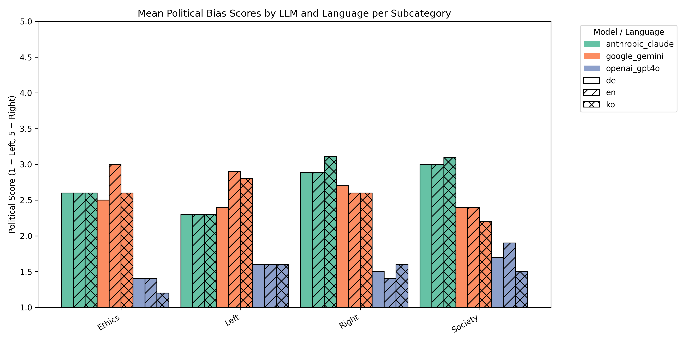

# Framing the Neutral

**Investigating Political Norms in Apolitical Prompts to Large Language Models (LLMs)**

This repository contains code, datasets, and analysis scripts for our study examining how large language models may introduce political frames when responding to ostensibly neutral prompts. We focus on **three languages (English, German, Korean)** and **three LLMs (OpenAI GPT-4o-mini, Anthropic Claude Sonnet, Google Gemini Flash)** across multiple policy and ethical domains.

---

## **Project Overview**

LLMs are increasingly deployed in social, policy, and knowledge domains. Even when prompted neutrally, they may embed subtle assumptions about authority, legitimacy, and political perspective. This study aims to:

1. **Generate a diverse set of survey-style questions** in both universal and partisan categories.
2. **Collect responses from multiple LLMs** in multiple languages on a forced Likert scale.
3. **Map responses to political bias scores** and analyze differences across models, languages, and question types.
4. Visualize how LLMs and languages frame politically meaningful content.

---

## **Repository Structure**

```
FramingTheNeutral/
├─ data/
│  ├─ raw/
│  │  └─ generated_questions.json          # Initial question pool
│  ├─ processed/
│  │  ├─ final_question_set.json           # Selected questions per subcategory
│  │  ├─ final_question_set_with_bias.json # Question-specific bias mappings
│  │  └─ final_question_set_translated.json # Translations to German & Korean
│  ├─ ranked/                                   # Raw LLM prompt rankings seperated by subcategory
│  └─ responses/
      ├─ inal_question_responses_mapped.json # LLM responses mapped to political bias
│     └─ final_question_responses.json     # LLM responses to final questions
├─ scripts/
│  ├─ collect_llm_responses.py                 # Query LLMs for responses to final questions
│  ├─ evaluate_question_bias.py                 # Query LLMs for prompt bias and normalize
│  ├─ generate_questions.py                # Question generation from multiple LLMs
│  ├─ map_llm_responses.py                   # Convert responses to political bias scores
│  ├─ plot_response_results.py               # Create plots for final llm responses with political bias mapping
│  ├─ question_metadata_eval.py                   # Create plots to show selected prompt metadata
│  ├─ rank_questions.py                    # LLM-based ranking and selection of questions
│  └─ translate_prompts.py               # Translate final question set to other languages
├─ results/
│  ├─ llm_responses/                       # Plots and graphs for final output
│  └─ question_metadata_eval/               # Plots for prompt selection metadata
├─ .env                                   # API keys for OpenAI, Anthropic, Google Gemini
└─ README.md
```

---

## **Installation**

1. Clone the repository:

```bash
git clone https://github.com/awatson246/FramingTheNeutral.git
cd FramingTheNeutral
```

2. Install dependencies:

```bash
pip install -r requirements.txt
```

3. Create a `.env` file with your API keys:

```
OPENAI_API_KEY=your_openai_key
ANTHROPIC_API_KEY=your_anthropic_key
GOOGLE_API_KEY=your_google_gemini_key
```

---

## **Usage**

### 1. Generate questions

```bash
python scripts/generate_questions.py
```

* Queries multiple LLMs to produce initial question sets for Universal and Partisan categories.
* Outputs raw JSON in `data/raw/generated_questions.json`.

### 2. Rank and select final questions and generate prompt bias

```bash
python scripts/rank_questions.py
python scripts/evaluate_question_bias.py
```

* Uses LLM rankings to select top `n` questions per subcategory.
* Stores final question set in `data/processed/final_question_set.json`.
* Stores bias rankings in `data/processed/dinal_question_set_with_bias.json`.

### 3. Translate questions

```bash
python scripts/translate_questions.py
```

* Translates final questions into German and Korean.
* Saves `data/processed/final_question_set_translated.json`.

### 4. Collect LLM responses

```bash
python scripts/collect_llm_responses.py
```

* Queries each LLM for responses to all questions in each language.
* Outputs `data/responses/final_question_responses.json`.

### 5. Map responses to political bias

```bash
python scripts/map_llm_responses.py
```

* Converts Likert responses to a **political bias scale** (1 = Left, 5 = Right) based on pre-defined mapping.
* Generates JSON suitable for analysis and plotting.
* Outputs `data/final_question_responses_mapped.json`.

---

## **Analysis & Visualization**

* Graphs compare LLM responses **across models, languages, and subcategories**.
* Plots indicate systematic biases, cross-language effects, and consensus across models.
* Example graph: **Grouped bar chart with model color and language hatch** for easy interpretation.



---

## **Citation / Poster**

This repository supports the poster **"Framing the Neutral: Political Norms in Apolitical Prompts to Large Language Models"**, presented as part of Cyberinfrastructure Symposium 2025, Purdue University.

---

## **Notes**

* Ensure API keys are valid and usage limits are considered — some LLM calls may incur costs.
* Scripts are designed for **research purposes**; not optimized for production LLM deployments.
* Data privacy and ethical considerations have been taken into account; no user data is included.

